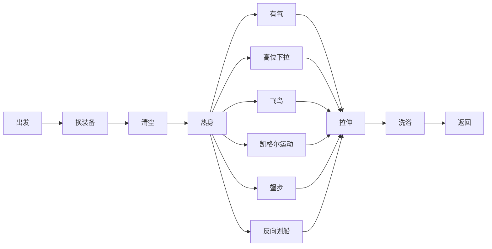

目标:
每一周4次健身.
流程:

以上是目前我最常用的健身的流程:

## 出发
9点,拿上健身装备从图书馆出发,找一辆共享单车,出发去健身房.
刷卡进入地下健身房
## 换装备
在浴室中,换上健身衣服.2分钟

## 清空
去厕所拉屎,然后装满饮用水.

## 热身
[连前总和热身](https://show.gotokeep.com/course/54afa52d35fb7f5912e3c6f9?utm_source=others&utm_medium=web&utm_campaign=client_share&utm_term=54afa52d35fb7f5912e3c6f9&utm_content=course&_uid=5c1a550c7511ce6c42c44d7d)

4分钟
## 有氧
[椭圆机](https://show.gotokeep.com/course/62870b23b154400001b3330c?utm_source=others&utm_medium=web&utm_campaign=client_share&utm_term=62870b23b154400001b3330c&utm_content=course&_uid=5c1a550c7511ce6c42c44d7d)

35分钟

## 高位下拉
12  * 4

5分钟

## 凯格尔运动

50kg,
12 * 4
5分钟

##  蟹步
15 * 4
5分钟

## 反向划船
15 * 4
5分钟

## 反向飞鸟

15 * 4
5分钟

## 拉伸
[连后拉伸](https://show.gotokeep.com/course/5721b7fcac4dbc5586c0ba8c?utm_source=others&utm_medium=web&utm_campaign=client_share&utm_term=5721b7fcac4dbc5586c0ba8c&utm_content=course&_uid=5c1a550c7511ce6c42c44d7d)
6分钟.

## 洗澡
洗完澡,吹干身体和衣服.

6分钟

## 返回

骑车反馈图书馆.

4分钟